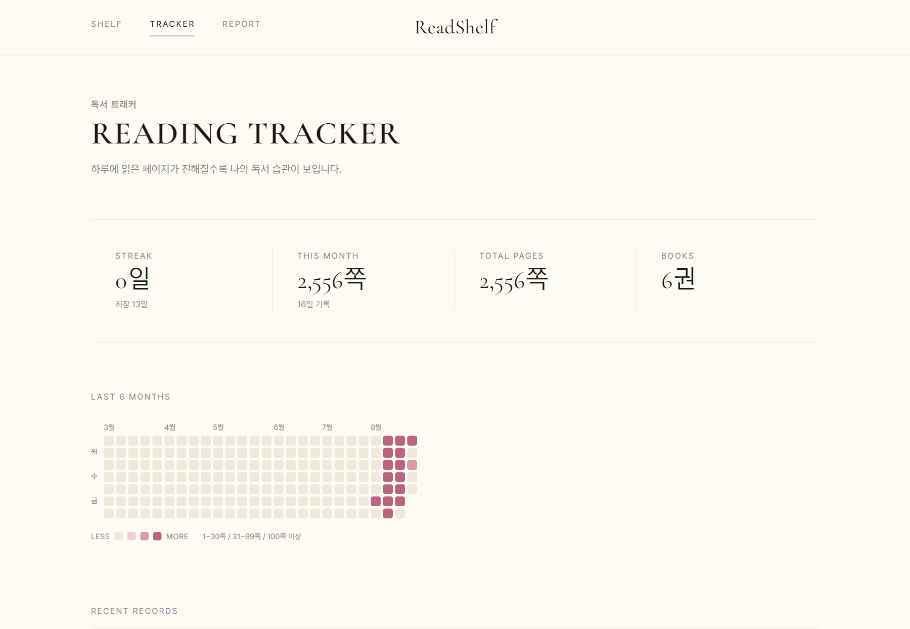
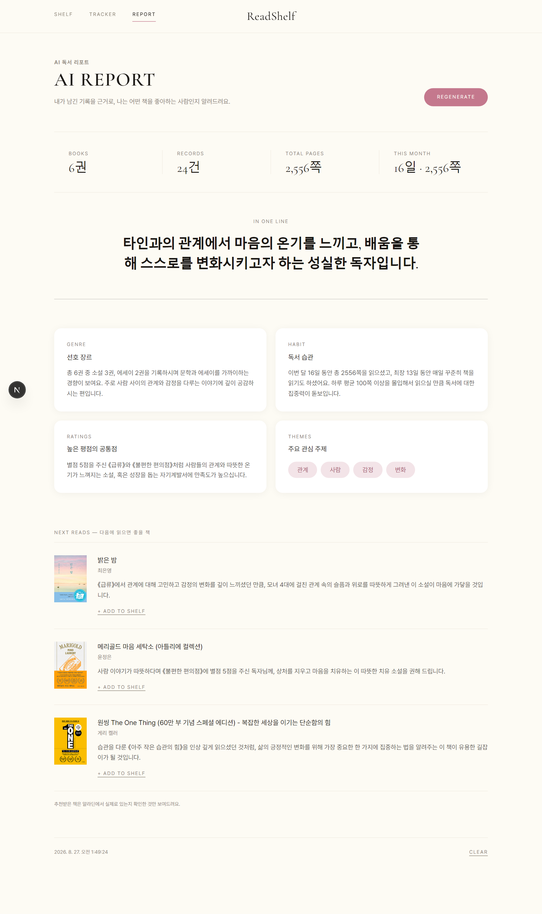

# ReadShelf

책을 읽고 기록할수록 AI가 나의 독서 습관과 취향을 발견해주는 독서 분석 도구.

읽은 책을 저장하는 데서 끝내지 않고, 쌓인 기록을 근거로 **"나는 어떤 책을 좋아하고, 어떻게 읽는 사람인가?"** 에 답합니다.

**🔗 [readshelf-murex.vercel.app](https://readshelf-murex.vercel.app)**

> **Hackathon MVP (v1.0)** — 해커톤 제출 시점의 완성본은 `v1.0-hackathon` 태그에 고정되어 있습니다.
> `main` 브랜치는 그 이후의 고도화(Post-Hackathon Development)가 이어집니다. → [버전](#버전)

<br>


<br>

## 무엇을 할 수 있나

**책장** — 제목만 검색하면 표지·저자·출판사·페이지 수가 한 번에 채워집니다. 책등은 페이지 수만큼 두꺼워지고, 실제 책 옆면을 찍어 올리면 그 사진이 그대로 책등이 됩니다.

**독서 기록** — 날짜와 페이지 범위, 인상 깊은 문장, 메모를 남깁니다. 이 기록이 그대로 AI 분석의 재료가 됩니다.

**독서 트래커** — GitHub 잔디처럼 날마다 읽은 양이 색으로 쌓입니다. 연속 독서일과 월간·누적 독서량을 함께 봅니다.

**AI 리포트** — 선호 장르, 관심 주제, 독서 습관, 높은 평점의 공통점을 분석하고, **다음에 읽을 책 3권을 추천**합니다.

<br>

| 독서 트래커 | AI 리포트 |
|---|---|
|  |  |

<br>

## 스택

- **Next.js 15** (App Router) + TypeScript + Tailwind CSS v4
- **DB 없음** — 모든 데이터는 브라우저 `localStorage`(`readshelf:v1`)에 저장
- **Gemini API** (`@google/genai`) — AI 리포트 생성, 서버 라우트 `POST /api/report`
- **알라딘 OpenAPI** — 책 검색과 추천 검증, 서버 라우트 `GET /api/books/search`·`/api/books/lookup`

## 실행

```bash
npm install
cp .env.example .env.local   # API 키 입력
npm run dev
```

**키가 없어도 책장 · 독서 기록 · 트래커는 전부 동작합니다.**

| 키 | 발급처 | 없으면 |
|---|---|---|
| `GEMINI_API_KEY` | [AI Studio](https://aistudio.google.com/apikey) — 무료, 결제 정보 불필요 | AI 리포트만 막힘 |
| `ALADIN_TTB_KEY` | [알라딘 OpenAPI](https://www.aladin.co.kr/ttb/wblog_manage.aspx) — 사이트 URL 등록 후 즉시 발급, 1일 5,000회 | 책 검색만 막힘 (표지를 직접 올리는 건 그대로 됨) |

> 빌드 전에 `npm run dev`를 먼저 내려주세요. 두 명령이 같은 `.next` 폴더를 써서, 동시에 돌리면 dev 서버가 사라진 청크를 참조하다 죽습니다. 타입 검사만 필요하면 `.next`를 건드리지 않는 `npx tsc --noEmit`을 쓰면 됩니다.

## 배포 (Vercel)

1. GitHub에 push → Vercel에서 Import
2. **Settings → Environment Variables** 에 두 키 추가 (Production + Preview)
3. **Deployments → ⋯ → Redeploy** — 환경 변수는 저장만으로 반영되지 않고 재배포가 필요합니다

DB가 없으므로 별도 연결은 필요 없습니다. 대신 **기기·브라우저가 바뀌면 기록도 달라집니다.**

<br>

## 화면

| 경로 | 화면 | 내용 |
|---|---|---|
| `/` | 책장 | 책등으로 쌓이는 책, 책 추가·수정, 목록 보기 |
| `/book/[id]` | 책 상세 | 표지 · 별점 · 한줄 후기 · 진행률 · 독서 기록 추가/수정/삭제 |
| `/tracker` | 독서 트래커 | 잔디 히트맵, 연속 독서일, 월간·누적 독서량, 최근 기록 |
| `/report` | AI 리포트 | 한줄 분석 · 선호 장르 · 관심 주제 · 독서 습관 · 평점 패턴 · 책 추천 |

## 데이터 구조

```ts
Book           { id, title, author, publisher, genre, totalPages, rating, review, createdAt,
                 spineColor, spineImage, spineAspect,   // 책등 — 색상 템플릿 또는 직접 찍은 사진
                 coverImage, coverAspect }              // 앞표지 — 알라딘 URL 또는 직접 올린 사진
ReadingRecord  { id, bookId, date, startPage, endPage, pagesRead, memo, quote, quotePage }
AIReport       { summary, preferredGenres, keywords[], readingHabit, ratingPattern,
                 recommendations[], generatedAt }
Recommendation { title, author, reason, coverUrl, isbn }
```

- **진행률** = 그 책 기록 중 가장 큰 `endPage` ÷ `totalPages`
- **잔디 단계** = 0쪽 / 1–30쪽 / 31–99쪽 / 100쪽 이상
- **연속 독서일** = 오늘(또는 어제)부터 거슬러 올라가며 기록이 끊기지 않은 일수

<br>

## 버전

| 구분 | 위치 | 내용 |
|---|---|---|
| **Hackathon MVP (v1.0)** | 태그 `v1.0-hackathon` | 해커톤 제출 시점 그대로 고정. 이후 커밋의 영향을 받지 않습니다. |
| **Post-Hackathon Development** | 브랜치 `main` | v1.0 이후의 고도화 작업이 쌓이는 곳. 배포되는 것도 이쪽입니다. |

해커톤 버전을 그대로 열어보려면:

```bash
git checkout v1.0-hackathon   # 그 시점의 코드
npm install && npm run dev
git checkout main             # 고도화 브랜치로 복귀
```
